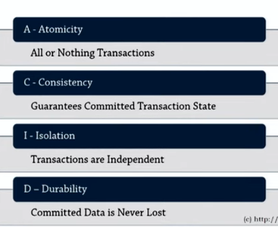
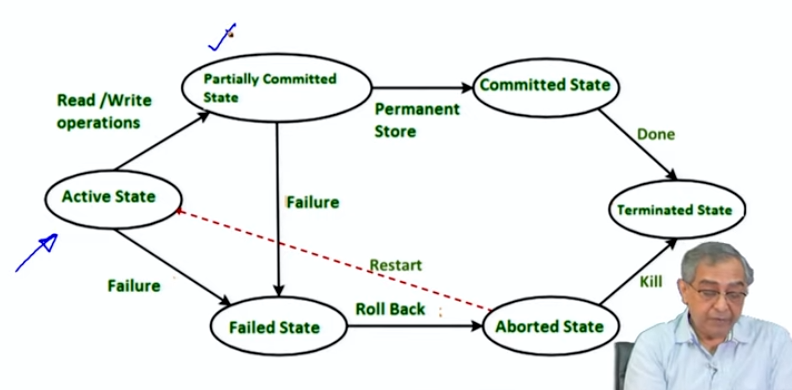
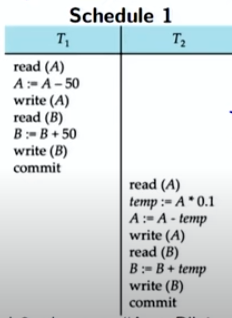
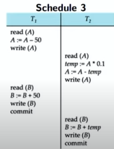
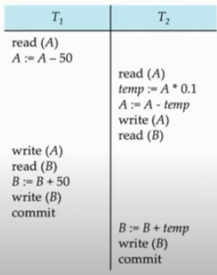

# Transaction/1

## Overview
- **Focus**: Transactions and Concurrent Execution
- **Previous Week**: Physical data organization, design considerations, accesses, indexing, hashing.
- **This Week**: Introduction to transactions and handling issues in concurrent transactions.

## Transactions
- **Definition**: Unit of program execution consisting of one or more instructions.
- **Operations**: Read, write, and other typical computations.
- **Example Transaction**: Transfer $50 from account A to account B.
  - Read A, deduct $50, write A.
  - Read B, add $50, write B.
  - Ensures atomicity, consistency, isolation, and durability (ACID).

## ACID Properties
1. **Atomicity**: Either all changes in a transaction occur, or none. No partial updates.
2. **Consistency**: The database is in a consistent state before and after a transaction.
   - Example: Sum of balances remains constant.
3. **Isolation**: Concurrent transactions do not impact each other until committed.
4. **Durability**: Changes made by a committed transaction persist despite failures.  

## Transaction States
- **States**: Active, Partially Committed, Failed, Aborted, Committed, Terminated.  
    - **Active**: The initial state, the transaction stays in this state while it is executing.
    - **Partially Committed**: After the final statement has been executed.  
    - **Failed**: After the discovery that normal execution can no longer be executed.
    - **Aborted**: After the transaction has been rolled back and database restored to its state prior to the start of transaction. Two options after abortion:  
        1. Restart the transaction. (Can only be done if no internal logic error)   
        2. Kill the Transaction.
    - **Committed**: After Successful completion of the transaction.  
    - **Terminated**: After it has been committed or aborted (killed).

## Concurrent Execution
- **Motivation**: Concurrent execution involves running multiple transactions simultaneously to improve system efficiency and response time. In a database system, transactions are sequences of operations (e.g., reads, writes). Concurrent execution allows these transactions to overlap in time.
- **Schedule**: Order of instructions from different transactions.
- **Properties of a Schedule**:
  1. Must consist all instructions involved of the transactions.
  2. Must preserve the order of instructions within each transaction.
- Successful transaction will have **commit** instructions as the last statement and failed transaction will have **abort** instructions as the last statement.

## Example Schedules
1. **Serial Schedule (Equivalent to Schedule 2)**:
   - Transactions executed sequentially, ensuring consistency.
   - Example:  

     
2. **Equivalent Serial Schedule (Schedule 3)**:
   - Concurrent execution but equivalent to a serial schedule.
   - Example:   
   
3. **Non-Serializable Schedule (Schedule 4)**:
   - Inconsistent state at commit, not equivalent to any serial schedule.
   - Example:  
   
