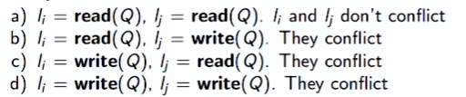
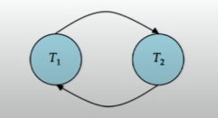

# Serializability

## Recap of Previous Modules:
- Transactions were defined as units of work that make changes to the database.
- The concept of concurrency, where multiple transactions operate on the same data simultaneously, was introduced.
- Not all schedules (sequences of instructions from different transactions) satisfy ACID properties (Atomicity, Consistency, Isolation, Durability).

## Module Objectives:
- Understanding how transactions can work concurrently.
- Exploring serializability and conflict serializability.

## Serializable Behavior:  
- Serializable behavior refers to the ability of a set of transactions or a schedule to produce the same results as if the transactions were executed in a serial (sequential) manner. In other words, a schedule is serializable if it is equivalent to some serial schedule, ensuring that the final state of the database is consistent and reflects the outcome of a valid execution order.
- Serializable schedules ensure that the consistency of the database is maintained, even when multiple transactions are executed concurrently.
- Transactions are assumed to be logically correct, meaning they do not contain errors that could lead to inconsistencies even in a serial execution.
- A schedule is serializable if it is equivalent to a serial schedule and produces the same data values.   
- Serializable behavior focuses on the logical order of operations (reads and writes) within transactions. Operations that do not affect consistency, such as arithmetic computations, are considered logically independent.  

## Conflict Serializability:
- Conflict serializability involves identifying conflicts between instructions of different transactions.
- Conflicts arise when at least one instruction writes to a data item that another instruction reads or writes.  
- Conflict serializability ensures schedules are equivalent to a serial schedule through a series of non-conflicting instruction swaps.  

## Example Schedules:
1. **Serial Schedule (Equivalent to Schedule 2):**
   - Transactions executed sequentially, ensuring consistency.

2. **Equivalent Serial Schedule (Schedule 3):**
   - Concurrent execution but equivalent to a serial schedule.

3. **Non-Serializable Schedule (Schedule 4):**
   - Inconsistent state at commit, not equivalent to any serial schedule.

## Testing for Conflict Serializability:
- **Precedence graph representation**:
    - Consider some set of a set of transactions *T1, T2, .., Tn*  
    - A direct graph where the vertices (or nodes) represent transactions, edges represent conflicts.  
    
- A schedule is conflict serializable if and only if its precedence graph is acyclic. If precedence graph is acyclic, the serializability order can be obtained by topological sorting of the graph.
- Topological sorting of the graph provides a conflict-serializable schedule.
- 

## Summary:
- Understanding concurrency, serializability, and conflict serializability.
- Recognizing conflicts and using graphs to test for conflict serializability.
- Conflict serializability is a sufficient condition for serializability.
