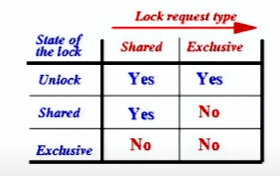
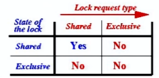
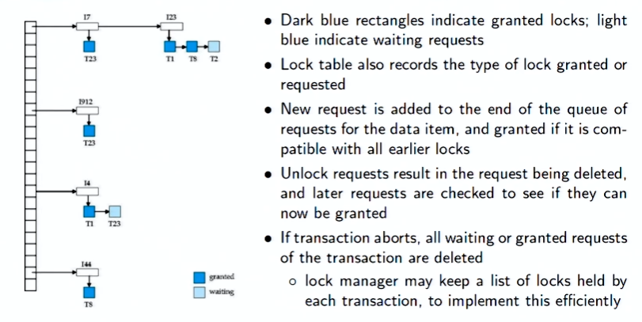

# Concurrency Control 1

## Concurrency Control  
- A database must provide a mechanism that will ensure that all possible schedules are both:  
    1. Conflict serializable
    2. Recoverable and, preferably, Cascadeless 

- A policy in which only one transaction can execute at a time generates serial schedules, but provides a poor degree of concurrency.  

- Concurrency-control schemes tradeoff between the amount of concurrency they allow and the amount of overhead that they incur.  

- Tests for serializability help us understand why a concurrency control protocol is correct.  
**Goal:** To develop concurrency control protocols that will assure serializability  

- One way to ensure isolation is to require that data items be accessed in a mutually exclusive manner; that is, while one transaction is accessing a data item, no other transaction can modify that data item.
    1. Should a transaction hold a lock on the whole database?
    - Would lead to strictly serial schedules - very poor performance.  
- The most common method used to implement locking requirement is to allow a transaction to access a data item only if it is currently holding a lock on that item.  

## Lock Based Protocol  
- A lock is a mechanism to control concurrent access to a data item.   
- Data items can be locked in two modes:
    1. *exclusive(X)* mode: 
        - Data item can be both read as well as written.    
        - **X-lock** is requested using **lock-Х** instruction.  
    2. *shared(S)* mode:
        - Data item can only be read
        - **S-lock** is requested using **lock-S** instruction.  

- A transaction can unlock a data item *Q* by the ***unlock(Q)*** Instruction.  
- Lock requests are made to the concurrency-control manager by the programmer.  
- Transaction can proceed only after the request is granted.    

## Lock Compatibility matrix  
A lock compatibility matrix is used which states whether a data item can be locked by two transactions at the same time.   
- **Full Compatibility Matrix:**  
  

- **Abbreviated Compatibility Matrix:**  
   

## Lock based Mechanism  

1. **Requesting for / Granting of a Lock**
    - A transaction may be granted a lock on an item if the requested lock is compatible with locks already held on the item by other transactions. 
2. **Sharing a Lock**
    - Any number of transactions can hold shared locks on an item.
    - But if any transaction holds an exclusive lock on the item no other transaction may hold any lock on the item.  
3. **Waiting for a Lock**
- If a lock cannot be granted, the requesting transaction is made to wait till all incompatible locks held by other transactions have been released.
4. **Holding a Lock**
- A transaction must hold a lock on a data item as long as it accesses that item.
5. **Unlocking / Releasing a Lock**
    - Transaction $T_i$ may unlock a data item that it had locked at some earlier point.  
    - It is not necessarily desirable for a transaction to unlock a data item immediately after its final access of that data item, since serializability may not be ensured.  

## Deadlock  
- Given, $T_3$ and $T_4$, consider Schedule 2 (partial)
- Since $T_3$ is holding an exclusive mode lock on *B* and $T_4$ is requesting a shared-mode lock on *B*, $T_4$ is waiting for $T_3$ to unlock B.
- Similarly, since $T_4$ is holding a shared-mode lock on *A* and $T_3$ is requesting an exclusive-mode lock on *A*, $T_3$ is waiting for $T_4$ to unlock *A*
- Thus, we have arrived at a state where neither of these transactions can ever proceed with its normal execution.  
- This situation is called **deadlock**.
- When deadlock occurs, the system must roll back one of the two transactions.
- Once a transaction has been rolled back, the data items that were locked by that transaction are unlocked.
- These data items are then available to the other transaction, which can continue with its execution.  
- If we do not unlock a data item before requesting a lock on another data item, deadlock may occur.
- Deadlocks are more preferable than inconsistent state, because they can undo certain transactions and move out of the deadlock.

## Two faced Locking Protocol  
- This protocol ensures conflict-serializable schedules
- **Phase 1:** Growing Phase
    - Transaction may obtain locks
    - Transaction may not release locks
- **Phase 2:** Shrinking Phase
    - Transaction may release locks
    - Transaction may not obtain locks
- The protocol assures serializability. It can be proved that the transactions can be serialized in the order of their **lock points**.
    - That is, the point where a transaction acquired its final lock  
- Any schedule that follows the two phase locking protocol is conflict serializable.  
- Two phase locking does not ensure freedom from deadlocks.

## Lock conversion  
- Two-phase locking with lock conversions:
    - **First Phase:**
        - can acquire a lock-S on item V
        - can acquire a lock-X on item
        - can convert a lock-S to a lock-X (upgrade)
    - **Second Phase:**  
        - can release a lock-S
        - can release a lock-X
        - can convert a lock-X to a lock-S (downgrade)
- This protocol assures serializability. But still relies on the programmer to insert the various locking instructions.    

## Automatic acquisition of locks: READ  
- A transaction $T_i$ issues the standard read/write instruction, without explicit locking call
- The operation ***read(D)*** is processed as:  
    - **if** $T_i$ has a lock on *D*
        - **then**
            - ***read(D)***  
        - **else begin**
            - if necessary, wait until no other transaction has a **lock-X** on *D* grant $T_i$ a **lock-S** on D;   
            ***read(D)***
        - **end**  

## Automatic acquisition of locks: WRITE  
- ***write(D)*** is processed as:
    - **if** $T_i$ has a **lock-X** on *D*
        - **then**
            - ***write(D)***
        - **else begin**
            - if necessary, wait until no other transaction has any lock on *D*,
            - if $T_i$ has a **lock-S** on *D*  
                - **then**
                    - **upgrade** lock on *D* to **lock-X**
                - **else**
                    - grant $T_i$ a **lock-X** on *D*
                - ***write(D)***
    - **end**;  
- All locks are released after commit or abort.   

## Starvation  
- In addition to deadlocks, there is a possibility of Starvation
- Starvation occurs if the concurrency control manager is badly designed. For example:
    - A transaction may be waiting for an X-lock on an item, while a sequence of other transactions request and are granted an **S-lock** on the same item
    - The same transaction is repeatedly rolled back due to deadlocks
- Concurrency control manager can be designed to prevent starvation
- Starvation is also loosely referred to as **Livelock** 

## Strict Two Phase Locking Protocol  
- To avoid Cascading roll-back, follow a modified protocol called **strict two-phase locking**
    - a transaction must hold all its exclusive locks till it commits aborts
- **Rigorous two-phase locking** is even stricter
    - All locks are held till commit/abort. In this protocol transactions can be serialized in the order in which they commit
- Note that concurrency goes down as we move to more and more strict locking protocol  

## Implementation of Locking  
- A lock manager can be implemented as a separate process to which transactions send
lock and unlock requests
- The lock manager replies to a lock request by sending a lock grant messages (or a
message asking the transaction to roll back, in case of a deadlock)
- The requesting transaction waits until its request is answered
- The lock manager maintains a data-structure called a lock table to record granted
locks and pending requests
- The lock table is usually implemented as an in-memory hash table indexed on the name
of the data item being locked  

## Lock Table  

