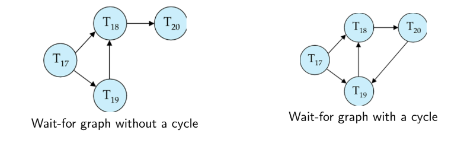
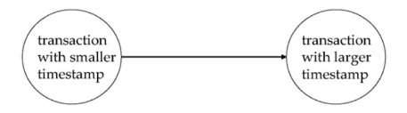

# Concurrency Control 1

## Deadlock Handling  
System is deadlocked if there is a set of transactions such that every transaction in the set is waiting for another transaction in the set  
- Deadlock Prevention protocols ensure that the system will never enter into a deadlock state. Some prevention strategies:  

    - Require that each transaction locks all its data items before it begins execution (pre-declaration).
    - Impose partial ordering of all data items and require that a transaction can lock data items only in the order specified by the partial order.  

## Deadlock Prevention  
- Transaction Timestamp: Timestamp is a unique identifier created by the DBMS to identify the relative starting time of a transaction. Timestamping is a method of
concurrency control in which each transaction is assigned a transaction timestamp.    

- Following schemes use transaction timestamps for the sake of deadlock prevention alone  
    - **wait-die scheme**: non-preemptive  
        - Older transaction may wait for younger one to release data item. (older means smaller timestamp)
            - Younger transactions never wait for older ones; they are rolled back instead
        - A transaction may die several times before acquiring needed data item  
        - **Example:**
            - Suppose that transaction T5, T10, T15 have time-stamps 5, 10 and 15 respectively
            - If T5 requests a data item held by T10 then T5 will ”wait”
            - If T15 requests a data item held by T10, then T15 will be killed (”die”)
    - **wound-wait scheme**: preemptive
        - Older transaction wounds (forces rollback) of younger transaction instead of waiting for it
            - Younger transactions may wait for older ones
        - May be fewer rollbacks than wait-die scheme.  
        - **Example:**
            - Suppose that transaction T5, T10, T15 have time-stamps 5, 10 and 15 respectively
            - If T5 requests a data item held by T10, then it will be preempted from T10 and T10 will be suspended (”wounded”).
            - If T15 requests a data item held by T10, then T15 will ”wait”.  

## Deadlock Prevention  
- Both in wait-die and in wound-wait schemes, a rolled back transaction is restarted with its original timestamp. Older transactions thus have precedence over newer ones, and starvation is hence avoided  

- **Timeout-Based Schemes:**
    - A transaction waits for a lock only for a specified amount of time. If the lock has not been granted within that time, the transaction is rolled back and restarted
    - Thus, deadlocks are not possible
    - Simple to implement; but starvation is possible. Also difficult to determine good value of the timeout interval.  

## Deadlock Detection  
- **Deadlock Representation:**
  - Deadlocks are depicted using a wait-for graph, denoted as G = (V, E).
  - V is a set of vertices, encompassing all transactions in the system.
  - E is a set of edges, where each element is an ordered pair Ti → Tj.

- **Wait-For Graph Structure:**
  - If Ti → Tj exists in E, a directed edge indicates that Ti is waiting for Tj to release a data item.
  - Insertion of Ti → Tj occurs when Ti requests a data item held by Tj.
  - Removal of the edge Ti → Tj happens when Tj no longer holds the required data item for Ti.

- **Deadlock Conditions:**
  - The system is in a deadlock state if and only if the wait-for graph contains a cycle.

- **Cycle Detection:**
  - Invoke a deadlock-detection algorithm periodically to identify cycles in the wait-for graph.  

    

## Deadlock Recovery  
- When deadlock is detected:
    - Some transaction will have to rolled back (made a victim) to break deadlock. Select that transaction as victim that will incur minimum cost  

    - Rollback – determine how far to roll back transaction
        - Total rollback: Abort the transaction and then restart it
        - More effective to roll back transaction only as far as necessary to break deadlock
    - Starvation happens if same transaction is always chosen as victim. Include the number of rollbacks in the cost factor to avoid starvation   

## Timestamp-Based Protocols  
- Each transaction is issued a timestamp when it enters the system. If an old transaction $T_i$ has time-stamp $(T_i)$, a new transaction $T_j$ is assigned time-stamp TS $(Tj)$ such that TS($Ti$) < TS($Tj$).  
- The protocol manages concurrent execution such that the time-stamps determine the serializability order   

- In order to assure such behavior, the protocol maintains for each data Q two timestamp values:
    - W-timestamp(Q) is the largest time-stamp of any transaction that executed write(Q) successfully
    - R-timestamp(Q) is the largest time-stamp of any transaction that executed read(Q) successfully.  
- The timestamp ordering protocol ensures that any conflicting read and write operations are executed in timestamp order
- Suppose a transaction $T_i$ issues a read(Q)
    - If TS(Ti) ≤ W-timestamp(Q), then Ti needs to read a value of Q that was already overwritten
    - Hence, the read operation is rejected, and $_i$ is rolled back.
    - If TS($T_i$) ≥ W-timestamp(Q), then the read operation is executed, and R-timestamp(Q) is set to max(R-timestamp(Q), TS($T_i$)).  

## .  
- The timestamp-ordering protocol guarantees serializability since all the arcs in the precedence graph are of the form:

Thus, there will be no cycles in the precedence graph 

- Timestamp protocol ensures freedom from deadlock as no transaction ever waits 
- But the schedule may not be cascade-free, and may not even be recoverable

