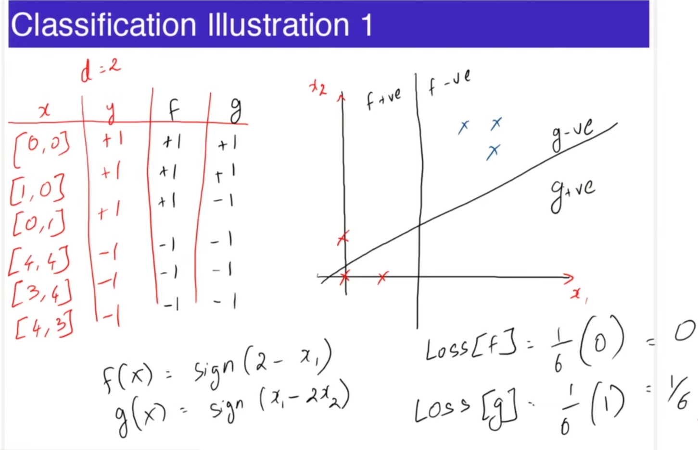

> The part before this is covered in the notes given by IITM in the dashboard itself, topics include: Introductory ML terminologies and Linear Regression, in this repo I continue the rest of it. [Link](https://bsc-iitm.github.io/karthikt/notes/linear_algebra/)

> Note !imp: We will use the following conventions to represent scalars, vectors and matrices:
> - Scalars are represented by small letters in normal font:
$x, y, z$.
> - Vectors are represented by small letters in bold-faced font:
$\textbf{x, y, z}$.
> - Matrices are represented by capital letters in bold-faced font:
$\textbf{X, Y, Z}$.

# Classification

Classification is a fundamental task in supervised learning.
It involves categorizing or grouping data into different classes or categories. It is a predictive Algorithm. The goal is to build a model that can accurately predict the class labels of unseen instances.    

The model learns patterns and relationships from a labeled dataset, then applies those patterns to classify new data. Classes can be binary (two categories) or multi-class (more than two categories).  

Use casess: Classification has numerous applications, including email spam filtering, sentiment analysis, image recognition, medical diagnosis, and fraud detection.

- Eg. Predict if rooms > 3 from area and price.  
- Training Data: $\{(\textbf{x}^1, y^1), (\textbf{x}^2, y^2), ... ,(\textbf{x}^n, y^n)\}$  
- $\textbf{x}^i \in \mathbb{R}^d, y^i \in \{+1, -1\}$  
- Algorithm outputs a model $f: \mathbb{R}^d \rightarrow \{+1, -1\}$  
- Loss = $\frac{1}{n}\Sigma_{i=1}^n 1(f(x^i) \neq y^i)$, Fraction of misclassified instances, hence the term $1(f(x^i) \neq y^i)$ will be $1$ if $f(x^i) \neq y^i$ and $0$ otherwise.  
- $f(x) = sign(\textbf{w}^T\textbf{x} + b)$, such a model is called a linear seperator.

## Classification Illustration  
If $(f(x), g(x) >= 0) \rightarrow +1$  
If $(f(x), g(x) < 0) \rightarrow -1$  

  

# Evaluation Learned Models  
Learning Algorithm uses training data $\{(\textbf{x}^1, y^1), (\textbf{x}^2, y^2), ... ,(\textbf{x}^n, y^n)\}$ to get model $f$.   

But Evaluating the learned model must not be done on the training data itself.  

Use test data is not in the training data for model selection.  

# Model Selection  
Model selection in machine learning refers to the process of choosing the best model from a set of candidate models. It involves evaluating and comparing different models based on their performance and selecting the one that performs the best on the given task and dataset.   

Model Selection is done by using another subset of data called validation data that is distinct from train and test data.