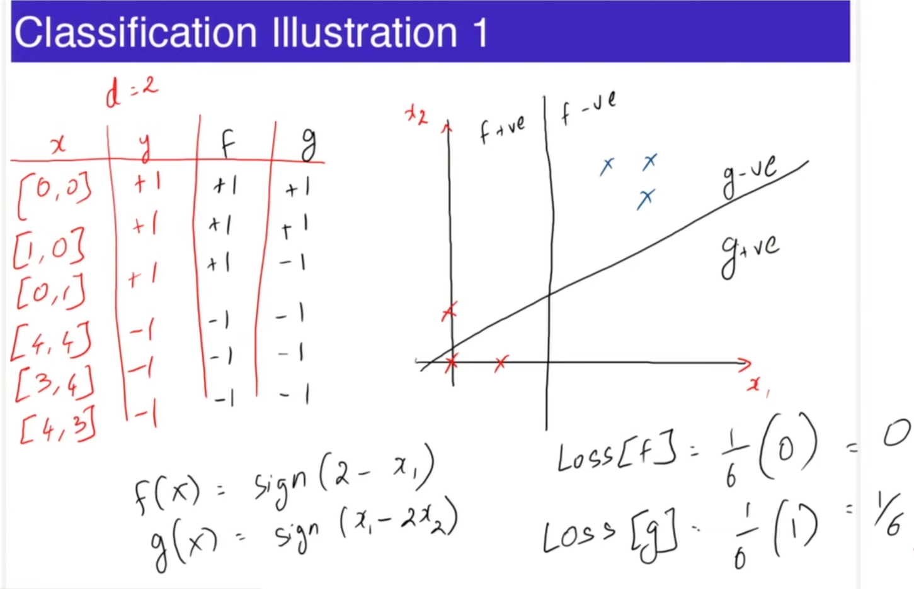

> The part before this is covered in the notes given by IITM in the dashboard itself, topics include: Introductory ML terminologies and Linear Regression, in this repo I continue the rest of it. [Link](https://bsc-iitm.github.io/karthikt/notes/linear_algebra/)

> Note !imp: We will use the following conventions to represent scalars, vectors and matrices:
> - Scalars are represented by small letters in normal font:
$x, y, z$.
> - Vectors are represented by small letters in bold-faced font:
$\textbf{x, y, z}$.
> - Matrices are represented by capital letters in bold-faced font:
$\textbf{X, Y, Z}$.

# Classification

Classification is a fundamental task in supervised learning.
It involves categorizing or grouping data into different classes or categories. It is a predictive Algorithm. The goal is to build a model that can accurately predict the class labels of unseen instances.    

The model learns patterns and relationships from a labeled dataset, then applies those patterns to classify new data. Classes can be binary (two categories) or multi-class (more than two categories).  

Use casess: Classification has numerous applications, including email spam filtering, sentiment analysis, image recognition, medical diagnosis, and fraud detection.

- Eg. Predict if rooms > 3 from area and price.  
- Training Data: $\{(\textbf{x}^1, y^1), (\textbf{x}^2, y^2), ... ,(\textbf{x}^n, y^n)\}$  
- $\textbf{x}^i \in \mathbb{R}^d, y^i \in \{+1, -1\}$  
- Algorithm outputs a model $f: \mathbb{R}^d \rightarrow \{+1, -1\}$  
- Loss = $\frac{1}{n}\Sigma_{i=1}^n 1(f(x^i) \neq y^i)$, Fraction of misclassified instances, hence the term $1(f(x^i) \neq y^i)$ will be $1$ if $f(x^i) \neq y^i$ and $0$ otherwise.  
- $f(x) = sign(\textbf{w}^T\textbf{x} + b)$, such a model is called a linear seperator.

## Classification Illustration  
If $(f(x), g(x) >= 0) \rightarrow +1$  
If $(f(x), g(x) < 0) \rightarrow -1$  

  

# Evaluation Learned Models  
Learning Algorithm uses training data $\{(\textbf{x}^1, y^1), (\textbf{x}^2, y^2), ... ,(\textbf{x}^n, y^n)\}$ to get model $f$.   

But Evaluating the learned model must not be done on the training data itself.  

Use test data is not in the training data for model selection.  

# Model Selection  
Model selection in machine learning refers to the process of choosing the best model from a set of candidate models. It involves evaluating and comparing different models based on their performance and selecting the one that performs the best on the given task and dataset.   

Model Selection is done by using another subset of data called validation data that is distinct from train and test data.

# Application  
**Problem:** An email service provider wants to automatically classify incoming emails as either "spam" or "not spam" (ham). They have a dataset of thousands of emails, each labeled as spam or not spam based on user reports and manual reviews. The goal is to create a machine learning model that can accurately classify emails as spam or not spam in real-time.  

1. **Data Collection:** Gather a labeled dataset of emails, where each email is labeled as either "spam" or "not spam." The dataset should include various features, such as the email's sender, subject, content, attachments, and metadata.

2. **Data Preprocessing:** Clean and preprocess the email data. This may involve tasks like text tokenization, stemming, and removing stop words. Convert the text data into numerical format using techniques like TF-IDF or word embeddings.

3. **Feature Engineering:** Extract relevant features from the email data. For example, you can create features based on the frequency of certain words or phrases, sender reputation scores, or the presence of suspicious attachments.

4. **Model Selection:** Choose a classification algorithm such as logistic regression, decision trees, random forests, or support vector machines (SVM) to build the spam classifier.

5. **Data Splitting:** Split the dataset into a training set and a testing set to evaluate the model's performance. Typically, 70-80% of the data is used for training, and the remaining portion is used for testing.

6. **Model Training:** Train the selected classification model using the training data. The model learns to differentiate between spam and not spam emails based on the provided features.

7. **Model Evaluation:** Evaluate the model's performance on the testing data using metrics like accuracy, precision, recall, and F1-score. Adjust the model parameters or try different algorithms if necessary to improve performance.  

**Conclusion:** By using supervised learning classification, the email service provider can efficiently filter out spam emails, improving user experience and email security. This example demonstrates how supervised learning can be applied to solve real-world problems by training a model to make predictions based on labeled data.