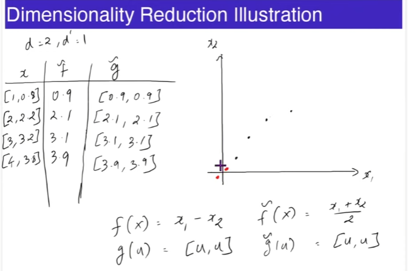

# Unsupervised Learning  
Contrary to Supervised Learning, Unsupervised learning is much more vague.  
Unsupervised Learning typically is used as a preprocessing step. It can be viewed as "understanding" data.  

- Data: $\{\textbf{x}^1, \textbf{x}^2, \dots , \textbf{x}^n\}$ (Notice there's no labeled $y^i$ along with the vectors.)  
- $\textbf{x}^i \in \mathbb{R}^d$   

The goal of unsupervised models is to compress, explain and group data.   

### Example  
**Problem:**  A retail company wants to improve its marketing strategy by targeting different customer segments more effectively. They have a large dataset containing customer information such as purchase history, demographics, and browsing behavior but don't have predefined labels or categories for customers.  

**Approach:** UsThe company can use unsupervised learning techniques, such as clustering, to group customers with similar characteristics together without any prior knowledge of what these groups might be. Here's how the process might work:  

1. **Data Collection:** Gather data on customers' purchase history, demographics, online behavior, and any other relevant information.

2. **Data Preprocessing:** Clean the data, handle missing values, and perform feature scaling if necessary.

3. **Clustering:** Apply clustering algorithms like K-Means, Hierarchical Clustering, or DBSCAN to group customers based on similarities in their data. For example, customers who frequently purchase high-end electronics might form one cluster, while those who mostly buy clothing might form another.

4. **Evaluation:** Assess the quality of the clusters using metrics like silhouette score or Davies-Bouldin index. Fine-tune the clustering parameters if needed.

5. **Interpretation:** Analyze the characteristics of each cluster to understand customer segments. For instance, one cluster might represent young tech enthusiasts, while another could consist of budget-conscious shoppers.

6. **Marketing Strategy:** Develop tailored marketing strategies for each customer segment. For example, the company might send promotions for the latest gadgets to the tech enthusiast cluster and offer discounts on clothing to the budget-conscious cluster.

7. **Monitoring and Adaptation**: Continuously monitor customer behavior and adjust marketing strategies as needed. As new data becomes available, the clustering model can be updated to reflect changing customer preferences.

**Conclusion:** This unsupervised learning approach allows the company to discover customer segments organically, which can lead to more personalized and effective marketing campaigns, ultimately improving customer satisfaction and increasing sales.  

# Dimensionality Reduction  
One technique of unsupervised learning is dimensionality reduction. It is a technique to simplify data by reducing the number of features while keeping important information. It helps in managing complex datasets and improving efficiency in machine learning and data analysis.  

**Problem:** An online image hosting platform wants to reduce storage costs and improve the efficiency of image transfer over the internet. Storing and transmitting large, high-resolution images can be resource-intensive. They want to find a way to represent images in a more compact form while preserving the essential visual information.

**Approach:** Dimensionality reduction techniques can be used to reduce the dimensionality of the image data while retaining as much relevant information as possible. Here's how this approach might be implemented:  

1. **Data Collection:** Collect a dataset of high-resolution images from the platform's users.

2. **Data Preprocessing:** Convert the images to a common format and size. Each image is represented as a matrix where each pixel corresponds to a feature.

3. **Dimensionality Reduction:** Apply dimensionality reduction techniques like PCA to reduce the number of features (pixels) in each image. PCA identifies the principal components (linear combinations of pixels) that capture the most variance in the data.

4. **Image Reconstruction:** Use the retained principal components to reconstruct the images with reduced dimensionality. These reconstructed images will be of lower resolution but should retain the key visual characteristics.

5. **Compression and Storage:** Store the compressed images, which require significantly less storage space than the original high-resolution images.

By using dimensionality reduction, the image hosting platform can significantly reduce storage costs and enhance user experience by delivering images more quickly. While the reduced-resolution images may not be suitable for all use cases (e.g., printing), they are ideal for online display, reducing bandwidth and storage requirements without compromising the essential visual content.

## Models  
The goal of dimensionality reduction model is to come up with two models. An **Encoder** and a **Decoder**.  

- $Encoder \space f : \mathbb{R}^d \rightarrow \mathbb{R}^{d'}$
- $Decoder \space f : \mathbb{R}^{d'} \rightarrow \mathbb{R}^d$
- $Goal: g(f(\textbf{x}^i)) \approx \textbf{x}^i$
- $Loss: \frac{1}{n}\Sigma_{i=1}^n ||g(f(\textbf{x}^i)) - \textbf{x}^i||^2$
- $d' < d$   

As we can observe in the image below that $\tilde{f}(x)$ and $\tilde{g}(x)$ are the better encoder and decoder pair.  

