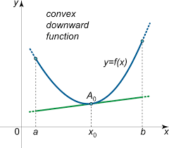

# Properties of Convex Functions  

If $\exists \space x$ s.t $\nabla f(x^{\ast}) = 0 \rightarrow x^{\ast}$ is a global minima.

By definition of convexity,
$$f(y) \geq f(x) + (y-x)\nabla f(x)^T \space \forall \space x, y$$

Hence, $f(y) \geq f(x^{\ast}) \space \forall \space y \rightarrow x^{\ast}$ is a global minima.

## Additional properties of convex fucntions

1. **Property 1:** If $f:\mathbb{R}^d \rightarrow \mathbb{R}$ and $g:\mathbb{R}^d \rightarrow \mathbb{R}$ are both convex, then $h(x) = f(x) + g(x)$ is a convex function.

2. **Property 2:** Let $f:\mathbb{R} \rightarrow \mathbb{R}$ be a convex and non-decreasing function and let $g:\mathbb{R}^d \rightarrow \mathbb{R}$ be a convex function, then $h(x) = (f \circ g)$ is convex.
Composition of convex+non-decreasing function with a convex function is convex. For example, $f(x) = ex, g(x) = x^2 \rightarrow h(x) = f(g(x)) = ex^2$

3. **Property 3:** Let $f:\mathbb{R} \rightarrow \mathbb{R}$ be convex and $g:\mathbb{R}^d \rightarrow \mathbb{R}$ be linear, then $h(x) = (f \circ g)$ is convex. For example, $f(x) = x^2, g(x) = -x \rightarrow h(x) = f(g(x)) = x^2$

> Note: In general if $f$ and $g$ are convex, then $h(x) = (f \circ g)$ may not necessarily also be complex. For example: $f(x) = e^{-x}, g(x) = x^2$