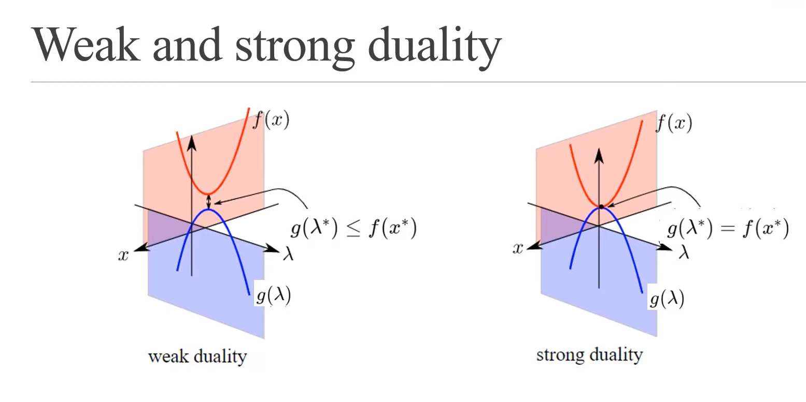
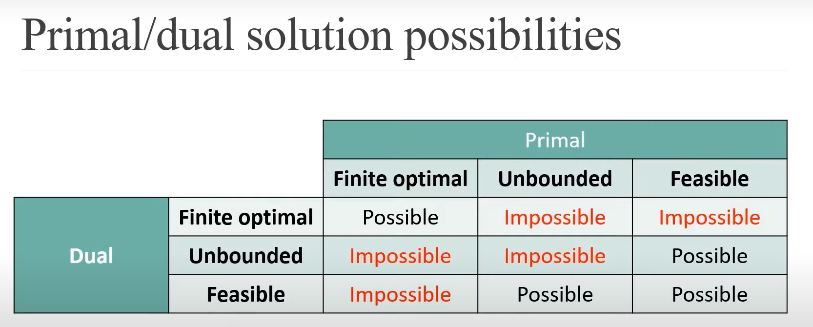

# Relation between Primal and Dual Problem, KKT Conditions

### **Primal Problem:**
$$x^{\ast} \rightarrow \text{min}_x [\text{max}_{\lambda \geq 0}  L(x, \lambda)]$$

### **Dual Problem:**
$$\lambda^{\ast} \rightarrow \text{max}_{\lambda \geq 0} [\text{min}_x  L(x, \lambda)]$$

> $L(x, \lambda) = f(x) + \lambda h(x)$

### **Introduction of Function J:**

$J(x) = \begin{cases}f(x) & \text{if } \space h(x) \leq 0 \\ \infty & \text{otherwise}\end{cases}$

### **Relation between Langragian and $J$:**
Fix $\lambda \geq 0$, then $L(x, \lambda) \leq J(x) \space \forall \space x$
$\text{min}_x L(x, \lambda) \leq \text{min}_x J(x) = f(x^{\ast}) \dots$ (Solution of Primal Problem)

$$\text{max}_{\lambda \geq 0}(g(x)) = g(\lambda^{\ast}) \leq f(x^{\ast})$$

> **Weak Duality: Value at dual optimum $\leq$ value at primal optimum.**

> **Strong Duality: If $f$ and $h$ are convex. Where $f$ is the objective function and $h$ is the constraint. And $x^*$ and $y^*$ are the primal and dual optimum solutions.**  

$$x^{\ast} = \text{argmin}_x [\text{max}_{\lambda \geq 0} f(x)+\lambda h(x)], \space \lambda^{\ast} = \text{argmax}_{\lambda \geq 0} [\text{min}_x f(x)+\lambda h(x)]$$

By Strong Duality, $f(x^{\ast}) = g(x^{\ast}) = \text{min}_x [f(x) + \lambda^{\ast}h(x)]$

$\therefore \nabla f(x^{\ast}) + \lambda^{\ast} \nabla h(x^{\ast}) = 0$

$\therefore f(x^{\ast}) \leq f(x^{\ast})+\lambda^{\ast} h(x^{\ast}) \leq f(x^{\ast})$

$\therefore \lambda^{\ast} h(x^{\ast}) = 0$

### **Putting it all Together:**
$f$ & $h$ are convex $\rightarrow$ strong duality.

$x^{\ast}, y^{\ast}$ must satisfy:
1. $\nabla f(x^{\ast}) + \lambda^{\ast} \nabla h(x^{\ast}) = 0 \dots$ [Stationary Condition, gradient of Lagrangian $(\nabla L(x^{\ast}, \lambda^{\ast}))$ is zero].
2. $\lambda^{\ast} h(x^{\ast}) = 0 \dots$ [Complementary Slackness condition, product of Lagrange multiplier and constraint is zero.]
3. $h(x^{\ast}) \leq 0 \dots$ [Primary Feasibility.]
4. $\lambda^{\ast} \geq 0 \dots$ [Dual Feasibility.]

> **In general, if $(x^{\ast}, y^{\ast})$ satisfies the above conditions, then it is a local minima.**

### **KKT (Karush-Kuhn-Tucker) Conditions:**
The KKT conditions are powerful tools to analyze and solve optimization problems, especially in the context of convex optimization. They provide a set of necessary and, under certain conditions, sufficient conditions for optimality.

Given the following objective function and constraints,

$\text{min} f(x) \\ h_i(x) \leq 0 \space \forall \space i = 1, \dots, m \\ l_j (x) = 0 \space \forall \space j = 1, \dots, n$

$L(\textbf{x}, \textbf{u}, \textbf{v}) = f(\textbf{x}) + \sum_{i=1}^m h_i(\textbf{x}) + \sum_{j=1}^n l_j(\textbf{x})$

The KKT conditions are: 
1. $\nabla f(\textbf{x}^{\ast}) + \sum_{i=1}^m u_i^{\ast} \nabla h_i(\textbf{x}^{\ast}) + \sum_{j=1}^n v_j^{\ast} \nabla l_j(\textbf{x}^{\ast}) = 0 \dots$ [Stationary Condition]  
2. $u_i^{\ast}h_i(x^{\ast}) = 0 \dots$ [Complementary Slackness condition]
3. $h_i(x^{\ast}) \leq 0 \dots$ [Primary Feasibility]
4. $u_i^{\ast} \geq 0 \dots$ [Dual Feasibility]

> In general, Dual is considered as the transpose of Primal Problem. If Primal is the minimization Problem having the upper bound on the right side then Dual is the maximization Problem having the lower bound the right side.  
