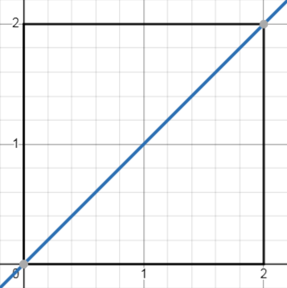
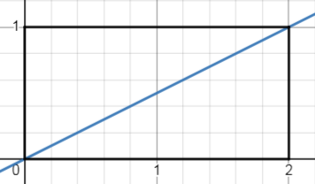

# Continuous random variables  

**An Experiment is made of 3 objects: $(\Omega, \mathcal{F}, \mathcal{P})$**  
- $\Omega :$ Sample Space  
- $\mathcal{F} : $ Collection of Events
- $\mathcal{P} :$ Probability Measure  

## Events as Sets and Sigma Algebra  

$$\mathcal{F} \in \{0, 1\}^{\Omega}$$  

Conditions to be a valid subset of Events:
1. $\Omega \in \mathcal{F}$
2. If $\mathcal{A} \in \mathcal{F}$ then $\mathcal{A}^c \in \mathcal{F}$.  
3. $\mathcal{A}_1, \mathcal{A}_2, \dots \mathcal{A}_n \in \mathcal{F} \rightarrow \cup_{i=1}^n \mathcal{A}_n \in \mathcal{F}$  

> $\mathcal{A}$ represents an event.  

## Probability Measures:  
$$\mathcal{P} : \Omega \rightarrow \mathbb{R}_+$$  

Conditions for the Probability Measure to be valid:

1. $\mathcal{P}(\mathcal{A}) \geq 0$
2. $\mathcal{P}(\Omega) = 1$
3. $\mathcal{P}(\mathcal{A}_1 \cup \mathcal{A}_2 \cup \dots \cup \mathcal{A}_n) = \sum_{i=1}^n \mathcal{P}(\mathcal{A}_i)$  

## Continuous Random Variable:
$$\mathcal{X}: \Omega \rightarrow \mathbb{R}$$  
- Domain, Codomain and Range of Discrete Random Variable is finite and countable whereas Domain, Codomain and Range of continuous random variable is infinite and uncountable.  

## Example 1

**Experiment:** Waiting for Bus. \
$\mathcal{X}:$ Amount of time you wait. \
**Bus arrivals:** 7:00, 7:15, 7:30, $\dots$ \
**You reach the bus stop:** Between 7:10 and 7:20

### Introducing PDF and CDF  
**PDF:** 
$$\mathcal{X}: f_\mathcal{X}(x) = \mathcal{P}(\mathcal{X} \in [x, x+\epsilon])$$ 
$$\mathcal{P}(\mathcal{X} = x) = 0$$ 

- Properties:
    - $f_\mathcal{X}(x) \geq 0$ 
    - $\int_{-\infty}^\infty f_\mathcal{X}(x)dx = 1$

**CDF:**  
$$\mathcal{X}: F_\mathcal{X}(x) = \mathcal{P}(\mathcal{X} \leq x)$$ 

- Properties:
    - $F_\mathcal{X}(-\infty) = 0$
    - $F_\mathcal{X}(\infty) = 1$
    - $F_\mathcal{X}(x)$ is always increasing.

> $\mathcal{X}$ represents Random Variable, $x$ represents an value in the range.   

## Example 2
$$f_\mathcal{X}(x) = \begin{cases}x & \text{if} \space x \in [0, 2] \\ 0 & \text{otherwise}\end{cases}$$  

  

- Check if it's a valid PDF.
    - Area should be 1
    - $\dfrac{1}{2} \cdot b \cdot h = 2$
    - Not a valid PDF.  
    
$$f_\mathcal{X}(x) = \begin{cases}\dfrac{x}{2} & \text{if} \space x \in [0, 2] \\ 0 & \text{otherwise}\end{cases}$$  

  

- Check if it's a valid PDF.
    - Area should be 1
    - $\dfrac{1}{2} \cdot b \cdot h = 1$
    - Valid PDF. 