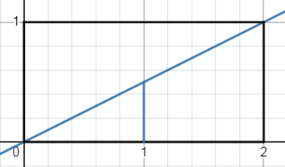

# Conditional PDF

## Conditional Probability Density Function (PDF) for Continuous Random Variables
   - Consider a probability experiment represented by $ (\Omega, \mathcal{F}, P) $ with a random variable $ \mathcal{X} $.
   - Let $ A $ be an event in $ \mathcal{F} $, and we want to find the conditional PDF of $ \mathcal{X} $ given $ A $.
   - The conditional PDF, denoted as $f_{\mathcal{X}|A}(x)$, is defined as follows:
     $f_{\mathcal{X}|A}(x) = \dfrac{P(\mathcal{X} \in [x, x+dx] \space |\space A)}{dx},$
   where $ dx $ is an infinitesimally small change in $ x $.
   
   - This expression is analogous to the standard PDF, but with the probability of $ \mathcal{X} $ belonging to the interval $ [x, x+dx] $ given that $ A $ has occurred.
   
## Example 1

**PDF:** $f_\mathcal{X}(x) = \begin{cases}\dfrac{x}{2} & \text{if} \space x \in [0, 2] \\ 0 & \text{otherwise}\end{cases}$ 

**Condition:** $A = \mathcal{X} > 1$

$\therefore f_{\mathcal{X}|A}(x) = \begin{cases} 0 & \text{if} \space \mathcal{X} < 1 \\ \dfrac{P(\mathcal{X} \in [x, x+dx] \space |\space A)}{\mathcal{P}(A)} & \text{if} \space x \in [1, 2] \\ 0 & \text{if} \space \mathcal{X} > 1 \end{cases}$  

$\because \mathcal{P}(A) = \displaystyle\int_1^2 \dfrac{x}{2} \\ \dfrac{x^2}{4} \bigg|^2_1 = \dfrac{3}{4}$

$\therefore  \dfrac{P(\mathcal{X} \in [x, x+dx] \space |\space A)}{\mathcal{P}(A)} = \dfrac{\frac{x}{2}}{\frac{3}{4}} = \dfrac{4x}{6}$

$\therefore f_{\mathcal{X}|A}(x) = \begin{cases} 0 & \text{if} \space \mathcal{X} < 1 \\ \dfrac{4x}{6} & \text{if} \space x \in [1, 2] \\ 0 & \text{if} \space \mathcal{X} > 1 \end{cases}$

## Functions of Random Variables

**1. Example: Uniform Distribution and Conditional PDF:**
   - Let $ X $ have a uniform distribution between -1 and 1, i.e., $ f_X(x) = \frac{1}{2} $ for $ -1 \leq x \leq 1 $.
   - Consider the function $ Y = \frac{X}{2} $.
   - Calculate the conditional PDF $ f_Y(y) $ for $ Y = \frac{X}{2} $ using the given information about $ f_X(x) $.

**2. Example: Absolute Value Function and Conditional PDF:**
   - Let $ X $ have a uniform distribution between -1 and 1.
   - Consider the function $ Y = |X| $.
   - Calculate the conditional PDF $ f_Y(y) $ for $ Y = |X| $ using the provided information about $ f_X(x) $.    
   
      
[Reference](https://www.probabilitycourse.com/chapter1/1_4_0_conditional_probability.php)