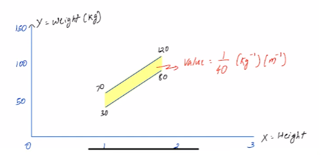

# Multiple Random Variable

**1. Introduction to Multiple Random Variables:**
   - Extension from single random variables to multiple random variables.
   - Similar concepts for discrete and continuous random variables.

**2. Joint Density Function:**
   - Denoted as $f_{X,Y}(x, y)$, representing the probability of $X$ and $Y$ jointly.
   - For continuous variables, $f_{X,Y}(x, y) = \dfrac{P(X \in [x, x+dx], Y \in [y, y+dy])}{(dx \cdot dy)}$.
   - Generalizes easily to more than two variables.

**3. Joint Cumulative Distribution Function (CDF):**
   - Denoted as $F_{X,Y}(x, y)$, representing the probability that $X \leq x$ and $Y \leq y$.
   - $F_{X,Y}(x, y) = P(X \leq x, Y \leq y)$.
   - Properties similar to CDFs for single variables.

**4. Properties of Joint Distributions:**
   - $f_{X,Y}(x, y) \geq 0$ and $\int \int f_{X,Y}(x, y) \,dx \,dy = 1$.
   - Joint CDF $F_{X,Y}(-\infty, -\infty) = 0$ and $F_{X,Y}(\infty, \infty) = 1$.
   - Monotonicity: $F_{X,Y}(a, b) \leq F_{X,Y}(c, d)$ if $a \leq c$ and $b \leq d$.

**5. Example: Height and Weight Distribution:**
   - Joint density function $f_{X,Y}(x, y)$ for height $X$ and weight $Y$.
   - Visualization of the distribution and calculation of the constant $C$.
   - Marginal densities $f_X(x)$ and $f_Y(y)$ obtained by integrating over the other variable.  
   
   

**6. Marginal and Conditional Distributions:**
   - Marginal Density $f_X(x) = \int f_{X,Y}(x, y) \,dy$ and $f_Y(y) = \int f_{X,Y}(x, y) \,dx$.
   - Conditional Density $f_{Y|X}(y|x) = \dfrac{f_{X,Y}(x, y)}{f_X(x)}$ for $f_X(x) > 0$.  
   
   - Conditional Density $f_{X|Y}(x|y) = \dfrac{f_{X,Y}(x, y)}{_Y(y)}$ for $f_Y(y) > 0$.

**7. Independence of Random Variables:**
   - Two random variables $X$ and $Y$ are independent if $f_{X,Y}(x, y) = f_X(x) \cdot f_Y(y)$.
   - Equivalently, for all functions $g$ and $h$, $E[g(X) \cdot h(Y)] = E[g(X)] \cdot E[h(Y)]$.