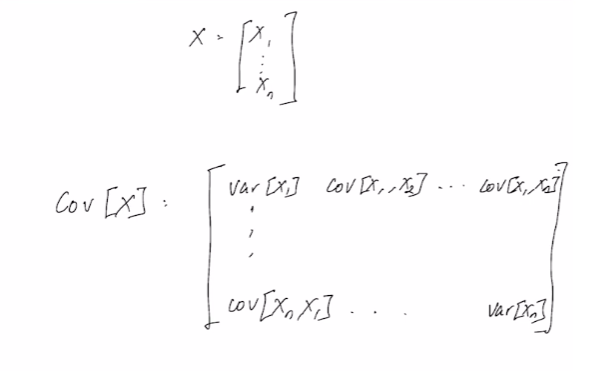

# Independent Random Variables

## *Introduction:*
- Definition of independence for random variables has been established.
- Exploring elementary operations on random variables, focusing on addition and the resulting convolution operation.
- Special case example: Addition of two independent random variables ($X$ and $Y$).

## *Convolution Operation:*
- Sum of independent random variables: $Z = X + Y$.
- Density function for $Z: f_Z(z) = \int_{-\infty}^{\infty} f_X(x) \cdot f_Y(z - x) \, dx$.
- Convolution operation is analogous to the discrete case but involves integration.
- Special case: Uniform distribution of $X$ and $Y$ in the range [0, 1].
  - Deriving the density function for $Z$ in this case, resulting in a triangular shape.

## *Max Operation:*
- Consider two independent random variables $X$ and $Y$.
- Define $Z$ as the maximum of $X$ and $Y$.
- Cumulative Distribution Function (CDF) of $Z: F_Z(z) = F_X(z) \cdot F_Y(z)$.
- Derive the density function for $Z$ by differentiating the CDF.

## *Min Operation:*
- Similar to max, but with the minimum of $X$ and $Y$.
- Using De Morgan's Laws to express the union as intersections and complements.
- Cumulative Distribution Function (CDF) of $Z: F_Z(z) = 1 - (1 - F_X(z)) \cdot (1-F_Y(z))$.

## *Covariance and Correlation:*
- Define covariance for two random variables $X$ and $Y$: $\text{Cov}(X, Y) = \text{E}[(X - \text{E}(X))(Y - \text{E}(Y))]$.
- Covariance is also expressed as $\text{Cov}(X, Y) = \text{E}(XY) - \text{E}(X)\text{E}(Y)$.
- Introduce correlation coefficient $\rho(X, Y) = \frac{\text{Cov}(X, Y)}{\sqrt{\text{Var}(X) \cdot \text{Var}(Y)}}$.
  - Properties of correlation coefficient:
    - Bounded between -1 and 1.
    - Interpretation of correlation coefficient values.
    - Covariance is zero if variables are independent or "uncorrelated". 

## *Covariance for Random Vectors:*
- Extend the concept to random vectors.
- Define covariance matrix for an N-dimensional random vector $\textbf{x}$.
- Covariance matrix is symmetric and represents the covariances between individual components.  

## *Note:*
- Correlation coefficient is a normalized version of covariance, bounded between -1 and 1.
  - If the correlation coefficient between two variables is -1, it indicates a perfect negative linear relationship.
  - Independent variables are always uncorrelated but the opposite is not always true. For example,  
    $X \sim Uniform([-1, 1])$  
    $Y = X^2$  
    $E[XY] = E[X^3]$  
    $\int_{-1}^1 \frac{x^3}{2} dx = 0$   
    $E[XY] = E[X][Y] = 0$  
    $\therefore$ As we can see the variables are dependent but uncorrelated.
