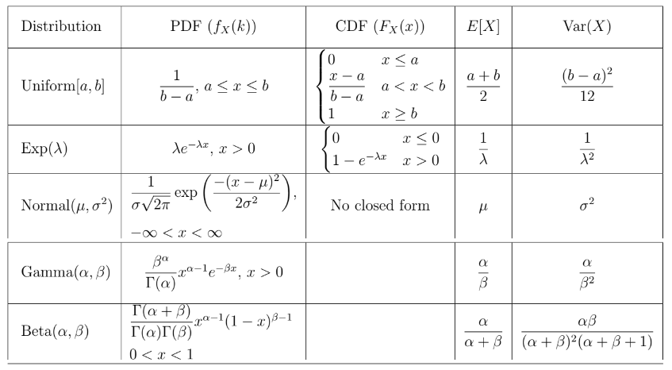

# Uniform, Normal and Exponential

**Uniform Distribution $X \sim \text{Uniform}(a, b)$:**
- Probability Density Function (PDF): $f_X(x) = \frac{1}{b - a}$ for $x$ in $[a, b]$, 0 otherwise.
- Expectation and Variance: $\text{E}(X) = \frac{a + b}{2}$, $\text{Var}(X) = \frac{(b - a)^2}{12}$.

**Exponential Distribution $X \sim \text{Exp}(\lambda)$:**
- PDF: $f_X(x) = \lambda e^{-\lambda x}$ for $x \geq 0$, 0 otherwise.
- Memorylessness Property: $P(X \geq a + b | X \geq b) = P(X \geq a)$.
- Expectation = Mean = $\text{E}(X) = \frac{1}{\lambda}$.

**Minimum of Exponentially Distributed Random Variables:**
- If $X$ and $Y$ are independent exponential distributions, $Z = \min(X, Y)$ is also exponential with $\lambda_{Z} = \lambda_{X} + \lambda_{Y}$.

**Normal Distribution $Z \sim \text{Normal}(0, 1)$:**
- PDF: $\frac{1}{\sigma\sqrt{2\pi}} 
  \exp\left( -\frac{1}{2}\left(\frac{x-\mu}{\sigma}\right)^{\!2}\,\right)$
- Validation of Density Function: $\int_{-\infty}^{\infty} e^{-x^2/2} \,dz = \sqrt{2\pi}$.
- Standard normal distribution is symmetric around 0 with a bell-shaped curve.
- Also called Gaussian Distribution

**General Normal Distribution $X \sim N(\mu, \sigma^2)$:**
- PDF: $f_X(x) = \frac{1}{\sigma \sqrt{2\pi}} e^{-\frac{(x - \mu)^2}{2\sigma^2}}$.
- Parameters: $\mu$ is the mean, $\sigma^2$ is the variance.
- Expectation: $\text{E}(X) = \mu$.
- Variance: $\text{Var}(X) = \sigma^2$.

**Summary and Practical Examples:**
- Central Limit Theorem: Many natural phenomena result in normally distributed outcomes.
- Real-world applications of normal distribution, e.g., measuring noise in an ammeter, modeling random variables in electronic components.

 

References:
1. [Special Distributions](https://www.probabilitycourse.com/chapter4/4_2_1_uniform.php)  
2. [Uniform Distribution](https://www.statlect.com/probability-distributions/uniform-distribution)
3. [Exponential Distribution](https://www.statlect.com/probability-distributions/exponential-distribution)
4. [Normal Distribution](https://www.statlect.com/probability-distributions/normal-distribution)