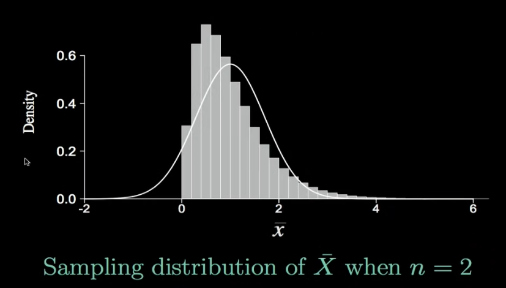
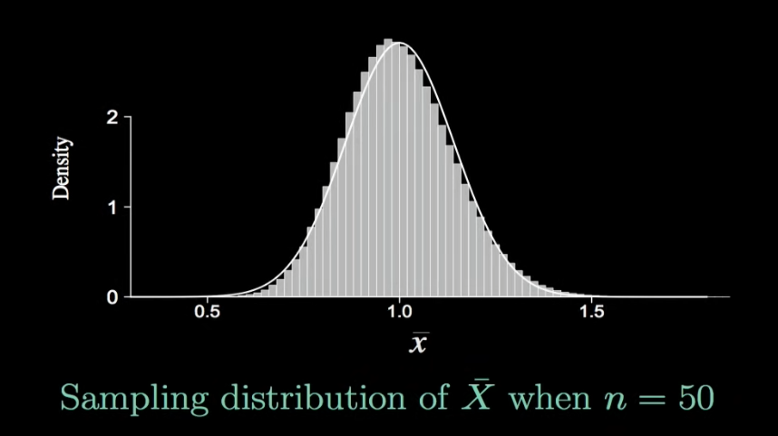
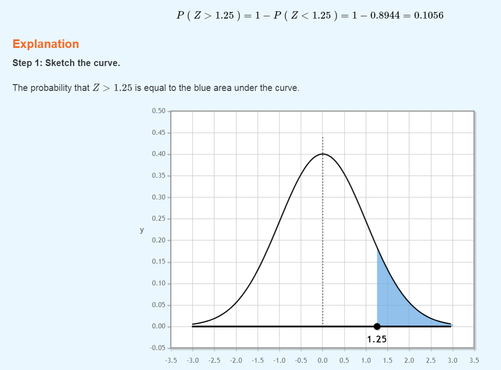

# Laws of Large numbers

## Summary of Weak Law of Large Number  

- $X_1, X_2, \dots, X_n \space \text{iid}$ with finite mean $\mu$ and variance $\sigma^2$.  

Sample Mean $: \bar{X_n} = \dfrac{X_1+ X_2+ \dots + X_n}{n}$    

Variance of Sample Mean:  
$E[\bar{X_n}] = \dfrac{E[X_1+ X_2+ \dots + X_n]}{n} = \dfrac{n \mu}{n} = \mu$    

Variance of Sample Variance:  
$Var(\bar{X_n}) = \dfrac{Var(X_1+ X_2+ \dots + X_n)}{n^2} = \dfrac{n \sigma^2}{n^2} = \dfrac{\sigma^2}{n}$  

Convergence:  
$P(|\bar{X_n} - \mu| \geq \epsilon) \leq \dfrac{Var(\bar{X_n})}{\epsilon^2} = \dfrac{\sigma^2}{n\epsilon^2} \xrightarrow[n \to \infty]{}\; 0$  
$P(|\bar{X_n} - \mu| \geq \epsilon) \xrightarrow[n \to \infty]{}\; 0$  
(as sample size $n$ grows infinitely large, the probability that the sample mean $\bar{X_n}$ deviates from the population mean $\mu$ by greater than or equal to $\epsilon$ approaches 0 and when the opposite case, it approaches $0$.)  
$P(|\bar{X_n} - \mu| < \epsilon) \xrightarrow[n \to \infty]{}\; 1$  

## Markov Inequality

### Markov Inequality Overview
1. **Motivation for Inequalities:**
   - Often interested in extreme events where a random variable takes a very large value.
   - In many cases, only have limited information, such as the expected value.

2. **Intuitive Statement:**
   - If the expected value of a non-negative random variable is small, the probability of it taking a very large value should also be small.
   - Markov inequality makes this statement precise.

3. **Markov Inequality:**
   - For a non-negative random variable i.e $X \geq 0$ and any positive number i.e $a > 0:$
     $ P(X \geq a) \leq \dfrac{E[X]}{a} $

4. **Interpretation:**
   - If the expected value of $X$ is small, the probability of exceeding a particular value $a$ is also small.
   - As $a$ increases, the probability decreases.

### Example

1. **Exponential Distribution:**
   - If $X$ is exponentially distributed with parameter $\lambda = 1$, Markov inequality gives a bound of $\dfrac{1}{a}$.  

## Chebyshev Inequality

## Introduction

- **Relationship with Markov Inequality:**
  - The Chebyshev inequality is a direct application of the Markov inequality.
  - Emphasizes the relationship between mean, variance, and the likelihood of a random variable deviating from its mean.

## Chebyshev Inequality

1. **Mean and Variance:**
   - For a random variable with a certain mean and variance, the Chebyshev inequality provides insights into the likelihood of deviations from the mean.

2. **Inequality Statement:**
   - If the variance is small, the random variable is unlikely to deviate significantly from the mean.
   - Precise statement: $P(|X - \mu| \geq c) \leq \dfrac{\sigma^2}{c^2}$

3. **Interpretation:**
   - If the variance is small, indicating little randomness, $X$ is less likely to be far from the mean.
   - As $a$ increases, the probability of significant deviations decreases.

4. **Large $c$ Scenario:**
   - If $c$ is large, representing a substantial distance from the mean, the probability falls off at a rate of at least $\dfrac{1}{c^2}$.

5. **Bounds for Distance from Mean:**
   - The probability of the distance from the mean being larger than a certain number is bounded by the variance divided by the square of that number.  

## Hoeffding's Inequality  

Hoeffding’s inequality is useful for bounding quantities that are hard to compute. It gives an upper bound on the probability that the sum of a set of random variables deviates from the expected value.

In layman’s terms, lets say we have a set of variables. When we find the average, we should usually get a result that’s close to the expected value. Hoeffding’s inequality formally states what this “close” and “usually” should be.

Although the inequality is a general result in probability theory, it is widely used in machine learning as well as more esoteric topics such as information theory, random algorithm analysis, and statistical learning theory.

Hoeffding’s inequality definition
There are several equivalent forms of Hoeffding’s inequality. One common one is:  
Suppose that random variables $X_1, \dots , X_n$ are independent. In addition, $a_i \leq X_i \leq b_i$, and $E[X_i] = \mu$. Then, for any $t > 0$,  

$$P(|\bar{X} - \mu| \geq t) \leq 2 \cdot \text{exp} \left(-\dfrac{2n^2 t^2}{\sum_{i=1}^n (b_i - a_i)^2}\right)$$  

Where, $\bar{X}_n = \dfrac{1}{n} \sum_{i=1}^n X_i$  

When When $a \leq X_i \leq b$ the formula becomes,  

$$P(|\bar{X} - \mu| \geq t) \leq 2 \cdot \text{exp} \left(-\dfrac{2n t^2}{ (b - a)^2}\right)$$  

> Note: Convergence in Probability implies convergence in distribution but not the other way around. 

## Central Limit Theorem  
The sample mean will be approximately normally distributed for large sample sizes, regardless of the distribution from which we are sampling.  

In a nutshell, Central Limit Theorem (CLT) asserts that, for a sufficiently large sample size, the sum or mean of independent and identically distributed random variables will exhibit a distribution that approximates a normal distribution, irrespective of the underlying population distribution

For example the original distribution was exponential and this is the sample mean ($\bar{X}$) of 1 Million observations for the respective sample size ($n$):  

   

> Note: A very rough guideline, the sample mean can be considered approximately normally distributed if the sample size is atleast 30 $(n \geq 30)$.  

### Formulation  
Provided $\mu$ and $\sigma^2$ are finite.
$$\dfrac{\bar{X} - \mu}{\sigma / \sqrt{n}} \xrightarrow{\text{}} \mathcal{N}(0, 1) \space \text{as} \space n \to \infty$$    

## Example  
Suppose salaries at a very large corporation have a mean of $\$62,000$ and a standard deviation of $\$32,000$.  
If 100 employees are randomly selected, what is the probability their average salary exceeds $\$66,000$?  

Answer:  
Given, $\mu = 62000$, $\sigma = 32000$ and $n = 100$   
To find, $P(\bar{X} > 66000)$ 

So, $P\left(Z > \dfrac{\bar{X} - \mu}{\sigma / \sqrt{n}}\right) = P\left(Z > \dfrac{66000 - 62000}{32000 / \sqrt{100}}\right) = P\left(Z > 1.25\right)$  

