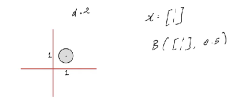

# Sets  

> The first Lecture is quite basic and there isn't much to cover here in notes.  
> **Conventions:** 
> - $\mathbb{R}$ - Set of Real Numbers.
> - $\mathbb{R}_+$ - Set of Positive Real Numbers including $0$.
> - $\mathbb{Z}$ - Set of Integers.
> - $\mathbb{Z}_+$ - Set of Positive Integers including $0$.
> - $[a, b]$ - $\{x \in \mathbb{R}: a \leq x \leq b\}$
> - $(a, b)$ - $\{x \in \mathbb{R}: a < x < b\}$
> - $\mathbb{R}^d$ - Set of $d$ dimensional vectors. 
$\begin{bmatrix}x_{11}\\x_{21}\\x_{31}\end{bmatrix} =  \mathbb{R}^3$
> - $[a, b]^d = \{x \in \mathbb{R}^d: x_i \in [a, b], i \in \{1, 2, \dots, d\}\}$

# Metric Spaces  

Metric Space is simply a set with extra structure associated with it. The structure is the distance function.   

$\mathbb{R}^d : D(\textbf{x}, \textbf{y}) = ||\textbf{x} - \textbf{y}|| = \sqrt{(\textbf{x}_1 - \textbf{y}_1)^2+\dots+(\textbf{x}_d - \textbf{y}_d)^2}$  

$Open \space Ball: B(\textbf{x}, \epsilon) = \{\textbf{y} \in \mathbb{R}^d : D(\textbf{x}, \textbf{y}) < \epsilon\}$  

$Closed \space Ball (has \space boundary): \bar{B}(\textbf{x}, \epsilon) = \{\textbf{y} \in \mathbb{R}^d : D(\textbf{x}, \textbf{y}) < \epsilon\}$  

  

# Vector Spaces  
If $V$ is a vector space, $u, v \in V$ and $\alpha, \beta \in \mathbb{R}$ then $\alpha u + \beta v \in V$.
- $\mathbb{R}^d$ is a vector space of $d$ dimensions.
- $x\cdot y = x^Ty = \Sigma_{i=1}^d x_i y_i$ (dot product)
- $||x||^2 = x\cdot x = x^Tx =  \Sigma_{i=1}^d x_i^2$
- $x$ and $y$ are orthogonal vectors/perpendicular if the dot product is $0$.  
$x\cdot y = x^Ty = \Sigma_{i=1}^d x_i y_i = 0$
- For a real valued function, codomain is $\mathbb{R}$.
