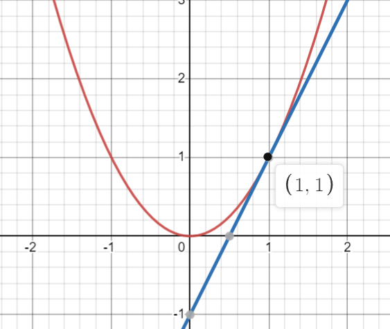

> Remark: Lecture 2.2 was on continuity and differentiability and there wasn't much to cover.  Refer to youtube videos or lecture slides.

How would you calculate $\sqrt{50}$ without a calculator?   
-> We may use Linear approximation:  
$x = 50   \\ 
a = 49 (\text{take the closest square})\\
f(a) = \sqrt{a}\\
L(x) = f(a) + f'(a)(x-a)\\
L(x) = 7 + \frac{1}{14}(50-49)\\
\therefore L(x) = 14.071$ 

Linear Approximation of $f(x) = x^2$  at  $a = 1$.  
-> $L(x) = f(a) + f'(a)(x -a)\\
L(x) = 1^2 + 2(x - 1)\\
\therefore L(x) = 2x - 1\\$   

Tangent to $f$ at the point $(1, 1)$ is $(x, f(x))$.  

- High Order (Derivate approximation) are more accurate than Linear Approximations.