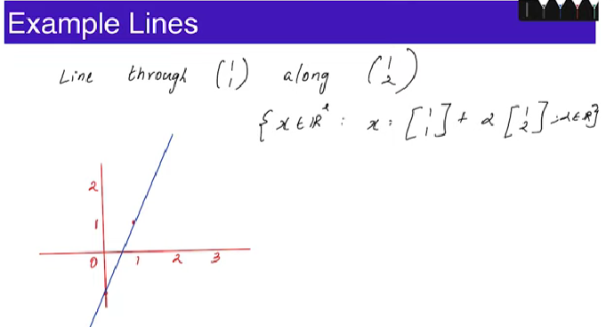
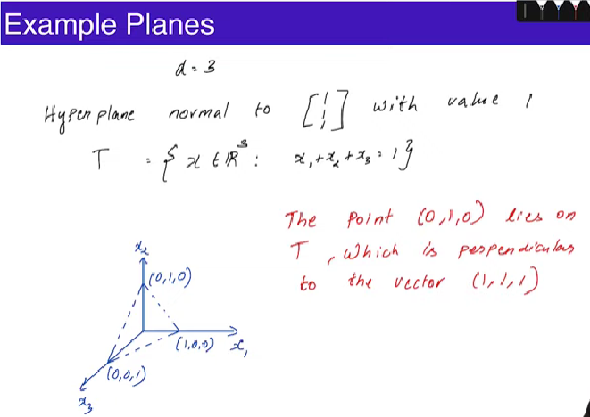

# Geometry of Lines  
1. Line in $\mathbb{R}^d \subseteq \mathbb{R}^d$.
2. A line through the point $\textbf{u} \in \mathbb{R}^d$ along the vector $\textbf{v} \in \mathbb{R}^d = \{\textbf{x} \in \mathbb{R}^d: \textbf{x} = \textbf{u} + \alpha \textbf{v} \space \text{for} \space \alpha \in \mathbb{R}\}$.  
3. Line through points $\textbf{u}, \textbf{u}' \in \mathbb{R}^d = \{\textbf{x} \in \mathbb{R}^d: \textbf{x} = \textbf{u} + \alpha(\textbf{u}'- \textbf{u}) \space \text{for} \space \alpha \in \mathbb{R}\}$.   

Example:

# Geometry of (Hyper)Planes  
A $(d-1)$ dimensional plane is called Hyperplane $\subseteq \mathbb{R}^d$.  
A hyperplane normal(perpendicular) to the vector $\textbf{w} \in \mathbb{R}^d$ with value $b \in \mathbb{R} = \{\textbf{x} \in \mathbb{R} : \textbf{w}^\text{T}\textbf{x} = b\}$.  

Example:  
  

- Contour plots of linear functions look like equidistantly spaced straight lines.

