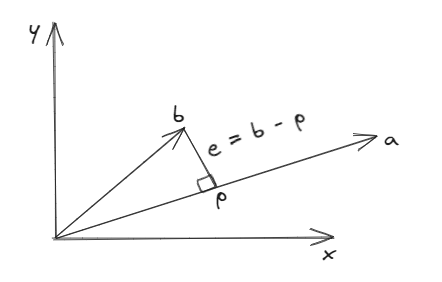

# Projection  
    
   
Want to Project $A$ onto the line through $B$, or, more generally onto the column space of a matrx $A$.  

1. Why Project?
2. Given a basis for a subspace $S$, is there any easy way to calculate the projection $p$ of $b$ onto $S$.  

-> Suppose we are given a dataset $\{(x_1, b_1), \dots, (x_n, b_n)\}$.  
e.g, $\begin{bmatrix}2x = b_1 \\ 3x = b_2 \\ 4x = b_3\end{bmatrix}$ or $\begin{bmatrix}x + 2y = 4 \\ x + 3y = 5 \\ 2x + 4y = 6\end{bmatrix}$  
These system are inconsistent i.e, no solution.   

Matrix View: $Ax = b$  
Inconsistent if $b \notin C(A)$.  
In such cases it makes sense to project $b$ onto $C(A)$.  

## Project onto a line     

     
 
$p = \alpha a$  
$e = b - p  = b - \alpha a$  
$e \perp a$  
$(b - \alpha a) \perp a$  
$a(b - \alpha a) = 0$  
$ab = \alpha a^2$  
$\frac{a \cdot b}{a\cdot a} = \frac{a^T b}{a^T a} = \alpha$    

## Projection Matrix  
$\mathbb{P} = (\frac{a^Tb}{a^Ta})a = (\frac{a^Ta}{a^Tb})b$  
Let $\mathbb{P} = \frac{aa^T}{a^Ta}$, then projection of $b$ onto $a$ is $\mathbb{P}b$.  

$\rightarrow$ To Project any vector $b$, just left multiply by the projection matrix $\mathbb{P}$.  
e.g, $a = \begin{bmatrix}1 \\ 1 \\ 1\end{bmatrix}$  
Projection Matrix $\mathbb{P} = \frac{aa^T}{a^Ta} = \frac{\begin{bmatrix}1 & 1 & 1\\ 1 & 1 & 1 \\ 1 & 1 & 1\end{bmatrix}}{\begin{bmatrix}3\end{bmatrix}} = \begin{bmatrix}\frac{1}{3} & \frac{1}{3} & \frac{1}{3}\\\\ \frac{1}{3} & \frac{1}{3} & \frac{1}{3} \\\\ \frac{1}{3} & \frac{1}{3} & \frac{1}{3}\end{bmatrix}$  

Points to Remember:  
- $\mathbb{P}$ is symmetric.
- $\mathbb{P} = \mathbb{P}^2$ i.e, $\mathbb{P}^2 b = \mathbb{P}b$ (already on projection, another round of projection won't change the value.)  
- $C(\mathbb{P})$ = line passing through $a = \begin{bmatrix}1 \\ 1 \\ 1\end{bmatrix}$.  
- $N(\mathbb{P})$ = plane orthogonal to $a = \begin{bmatrix}1 \\ 1 \\ 1\end{bmatrix}$ (rank = 1)   