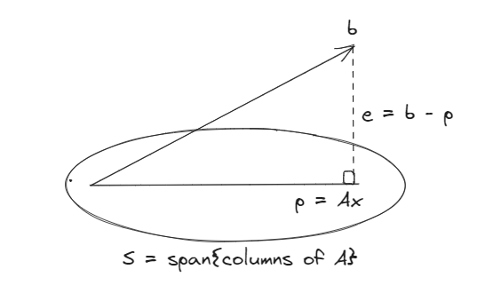

# Least Squares and Projection onto Subspace

## Least Squares  
$\begin{bmatrix}2x = b_1 \\ 3x = b_2 \\ 4x = b_3\end{bmatrix}$   
This System is solvable if $b$ is on the line through $a=\begin{bmatrix}2 \\ 3\\ 4\end{bmatrix}$   

Suppose, we have a vector $b$ that leads to an "inconsistent" system.  
We could pick a subset of equations and solve it exactly.  
Problem with this approach: large errors in some inputs and no error in others.  

Reasonable approach: minimize average error.  
  
$E^2 = (2x - b_1)^2 + (3x - b_2)^2 + (4x - b_3)^2$   

-> minimizing the sum of squared error.    

$\cfrac{dE^2}{dx} = 0 = 2[2(2x - b_1) + 3(3x - b_2) + 4(4x - b_3)] = 0$   

leading to,  

$\hat{x} = \cfrac{2b_1 + 3b_2 + 4b_3}{2^2 + 3^2 + 4^2} = \cfrac{a^Tb}{a^Ta} \dots a=\begin{bmatrix}2 \\ 3\\ 4\end{bmatrix}$  

## Projection onto a Subspace  

$Ax = b, A = m \times n, m > n$  
want: Projection of $b$ onto column space $C(A)$   
  
  

Projection of $b$ onto $S$ is $p = A\hat{x}$ orthogonal vector $e = b-p = b - A\hat{x}$.  

Q. How to find $\hat{x}$?  
- Observe $e \perp$ every vector in $C(A)$  
Recall that $C(A) \perp N(A^T)$, i.e $N(A^T)$ is the orthogonal complement of $C(A)$ i.e every vector in $C(A)$ is orthogonal to every vector in $N(A^T)$ and any given vector is in either $C(A)$ or $N(A^T)$.  

Q. Where does $e$ belong?  
- $e \in N(A^T) = A^Te = 0 = A^T(b - A\hat{x}) = 0$ leading to $A^TA\hat{x} = A^Tb \rightarrow$ equation to solve to obtain the projection of $b$ onto $C(A)$. (!Note: Even if $Ax = b$ is not solvable, $A^TA\hat{x} = A^Tb$ has a solution.)   

**Bottom line:- Solving $A^TA\hat{x} = A^Tb$ leads to $\hat{x}$ that minimizes $||Ax-b||^2$.**    

Remarks:  
1. Suppose columns of $A$ are linearly independent then, $A^TA$ is invertible.  
Solving $A^TA\hat{x} = A^Tb$ when $(A^TA)$ is invertible.   
$\hat{x} = (A^TA)^{-1} A^Tb$  
Projection $\mathbb{P} = A\hat{x} = A(A^TA)^{-1}A^Tb$  

2. $b \in C(A)$ i.e, $b = Ax$  
$p = A(A^TA)^{-1}A^Tb = A(A^TA)^{-1}A^TAx = Ax = b$  

3. $b \in N(A^T)$  
$p = A(A^TA)^{-1}A^Tb = 0$ since $A^Tb = 0$   

4. A is square & invertible <=> $C(A) = \mathbb{R}^n$    
$p = A(A^TA)^{-1}A^Tb = AA^{-1}(A^T)^{-1}A^Tb = b$  

**Final Remarks:- If $\mathbb{P}^2 = \mathbb{P}$ and $\mathbb{P}$ is symmetric, then $\mathbb{P}$ is a projection matrix and converse is also true. $\mathbb{P}b=$ Projection of $b$ onto the column space of $\mathbb{P}$ .**