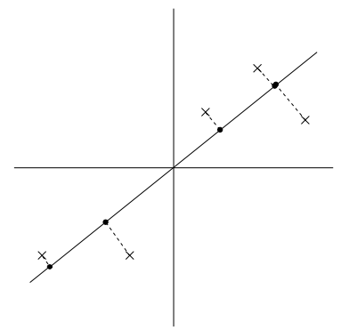
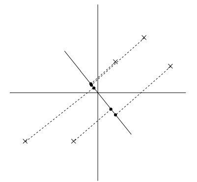

# Principal Components Analysis
Principal Components Analysis (PCA), that tries to identify the subspace in which the data approximately lies. PCA is computationally efficient, it only requires an eigenvector calculation. Additionally, it is an unsupervised learning technique used for dimensionality reduction.     

Imagine you have a dataset in three dimensions: height, weight, and age of a group of people. Each person in the dataset is a data point represented by a vector (height, weight, age). Now, PCA aims to find the directions in which the data varies the most.  
In this case, let's say that height and weight have high variance compared to age. PCA would identify the directions (principal components) along which the data varies the most. These directions are orthogonal to each other.   
Now, instead of representing each person in the original three-dimensional space, PCA allows you to project them onto a new subspace defined by these principal components. This new subspace retains the most important information about the data while reducing the dimensionality.    

Getting a little technical...   
Suppose we are given a dataset $D = \{x_i; i = 1, \dots, n\}$ of attributes of $n$ different vehicles, such as their maximum speed, turn radius, and
so on. Let $x_i \in \mathbb{R}^d$ for each $i \space (d \ll n)$.  But unknown to us, two different attributes some $x_i$ and $x_j$ respectively give a car’s maximum speed measured in miles per hour, and the maximum speed measured in kilometers per hour. These two attributes are therefore almost linearly dependent, up to only small differences introduced by rounding off to the nearest mph or kph. Thus, the data really lies approximately on an $d − 1$ dimensional subspace. How can we automatically detect, and perhaps remove, this redundancy?   

## PCA (main idea)  
Project given data onto a lower dimensional subspace (dimensionality reduction) such that:  
1. Reconstruction Error is minimized.
2. Variance of the Projected data is maximized.   

   
$\text{fig. 1}$   

We see that the projected data for the following data points has a fairly large variance, and the points tend to be far from zero. In contrast, suppose had instead picked the following direction: 

   
$\text{fig. 2}$  

Here, the projection have a significantly smaller variance and are much closer to the origin.  
We would like to automatically select the direction $u$ that preserves the maximum variance and reduces the reconstruction error.

## Formulation  
To formalize this,   

Given:- Dataset $D = \{x_1, \dots, x_n\}, x_i \in \mathbb{R}^d$.  
Goal:- Project $D$ onto a $m$ dimensional subsace, where $m < d$.  

Note that given a unit vector $u$ and a point $x$ , the length of the projection of $x$ onto $u$ is given by $x^Tu$ i.e if $x_i$ is a point in our dataset (one of the crosses in the plot), then it's projection onto $u$ (the corresponding bold dot in the plot) is distance $x^Tu$ from the origin. Hence to maximize the variance of the projection, we would like to choose a unit length $u$ so as to maximize variance:  

$\rightarrow \text{Projection}_{u}(x) = (x^Tu)u$   
$\rightarrow \text{Mean of Projection}_{u}(x) = (\bar{x}^Tu)u$   
$\rightarrow \text{Variance of Projection}_{u}(x) = \frac{1}{n} \sum_{i=1}^n (x_i^Tu - \bar{x}^Tu)^2$  
$= \frac{1}{n} \sum_{i=1}^n [u(x_i^T - \bar{x}^T)]^2$   
$= \frac{1}{n} \sum_{i=1}^n u^T(x_i - \bar{x})(x_i - \bar{x})^Tu$  

> Digression: $C = \frac{1}{n} \sum_{i=1}^n (x_i - \bar{x})(x_i - \bar{x})^T$ is known as the [covariance matrix](https://youtu.be/152tSYtiQbw?si=FzQkXLCWVyccBB5d) and $u$ is a constant variable.   

$\therefore \text{Variance of Projection}_{u}(x) = u^TCu$  
---
Next Step, we'll try to maximize the variance of the projection.    

$\text{Max} \space (u^TCu)$ with subject to constraint (s.t) $u^TCu = 1$, we'll write in the form:  
$\begin{bmatrix}\text{Max} \space  (u^TCu)\\ \text{s.t} \space (u^Tu) = 1\end{bmatrix}$  

When employing the [Lagrange multiplier](https://youtu.be/5A39Ht9Wcu0?si=-xl-MoNk98Q8dDEv) method and considering the objective function, the result is:   

$\rightarrow u^TCu + \lambda(1 - u^Tu)$  
$\rightarrow \frac{d}{du}u^TCu + \lambda(1 - u^Tu)$  
$\rightarrow 2Cu - 2\lambda u = 0$  
$\rightarrow 2Cu = 2\lambda u$  
$\rightarrow Cu = \lambda u$  $\dots$ [$u$ is an eigenvector of $C$ and $\lambda$ is the eigenvalue.]  

We left multiply,   

$u^TCu = \lambda u^Tu$ $\dots$ [$u^Tu = 1$]  
$\therefore u^TCu = \lambda$  

In order to maximize the projection, we need to essentially find the greatest eigenvalue and the respective eigenvector.  
---

# Reference guide:  
**Step 1:** Compute the mean vector $\bar{x}$  
$$\bar{x} = \frac{1}{n} \sum_{i=1}^n x_i $$  

**Step 2:** Compute the covariance matrix $C$  
$$C = \frac{1}{n} \sum_{i=1}^n (x_i - \bar{x})(x_i - \bar{x})^T$$   

**Step 3:** Find eigenvalues and eigenvectors.  

**Step 4:** Select eigenvectors corresponding to the greatest eigenvalues k and derive the transformed data point on the projection.  

$$\tilde{x}_i = \sum_{j=1}^k \alpha_j u_j, \text{where} \space \alpha_j = (x_i^Tu_j) \space \text{and} \space u_j = \text{eigenvector}$$   

**Step 5:** Calculate the reconstruction error and projected variance as:   
$$\text{Reconstructor Error} = J = \frac{1}{n} \sum_{i=1}^n ||x_i - \tilde{x}_i||^2$$    
$$\text{Projected variance} = \lambda_1 + \lambda_2+ \dots + \lambda_k$$  

> Note: Since the covariance matrix is symmetric, its eigenvector (or also known as principal component) is orthogonal to each other.

