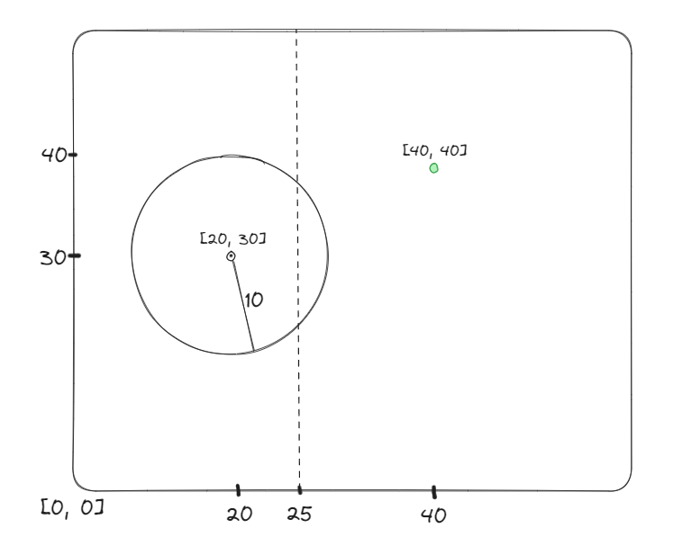

# What is optimization?  
In machine learning, optimization is like finding the best settings for a model to make it perform really well on a task. It's like tweaking the knobs on a radio to get the clearest signal—adjusting the model's internal settings until it works as effectively as possible. This process often involves using mathematical techniques to gradually refine these settings until the model does what you want it to do with high accuracy.    

# Why Optimization?   
We care about finding the "best" model.   
$\text{"best"} \rightarrow \begin{cases} \text{Least Loss} \\ \text{Maximum Reward}\end{cases}$   

$\rightarrow$ E.g  
Suppose you have a square field.   

  

- Cow at $\begin{bmatrix}20 \\ 30 \end{bmatrix}$ tied to a 10 unit radius rope.  
- Perpendicular fence that pases through $\begin{bmatrix}25 \\ 0 \end{bmatrix}$.  
- Grass on the field at $\begin{bmatrix}40 \\ 40 \end{bmatrix}$.  

$\rightarrow$ How close can cow get to the grass?  
Formulation:  
1. What are we measuring?  
Distance from grass at $\begin{bmatrix}40 \\ 40 \end{bmatrix}$  

Say cow is at $\begin{bmatrix}x_1 \\ x_2 \end{bmatrix}$, then  

$d(\begin{bmatrix}x_1 \\ x_2 \end{bmatrix}, \begin{bmatrix}40 \\ 40 \end{bmatrix}) = (x_1 - 40)^2 + (x_2 - 40)^2$  

1. What to do with distance?    
Minimize it as low as possible.  

**Constraints:** 
1. Rope Restriction: $(x_1 - 20)^2 + (x_2 - 30)^2 \leq 10^2$  
2. Fence restriction: $x_1 \leq 25$ (cow can move vertically anywhere but has restriction horizontally i.e $x_1$)  

# General Form   
**Objective function:-**
$$\text{min} \space f(x), x \in \mathbb{R}^d$$  
$$\text{Constraints} = \begin{cases} g_i(x) \leq 0 \space \forall \space i = 1, \dots, k \\ h_j(x) \leq 0 \space \forall \space j = 1, \dots, k\end{cases}$$