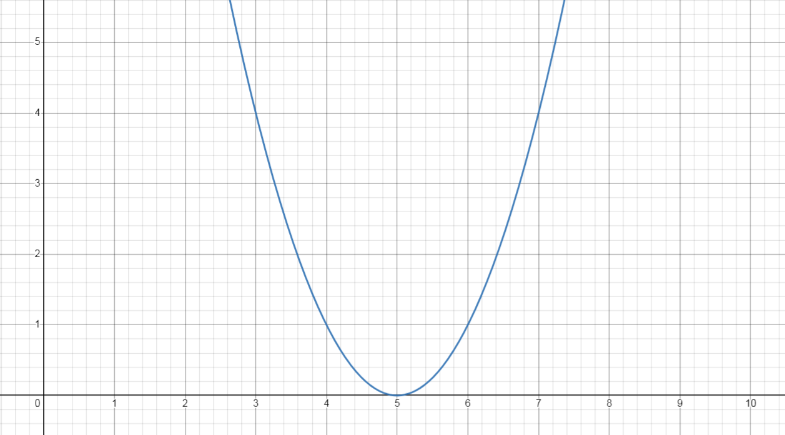

# Unconstrained Optimization  
Minimize the function $(x-5)^2$  
$f'(x) = 0$  
$2(x-5) = 0$  
at $x = 5$, function is minimum.  

Another example,   
$\text{min} \space 3x^6 + 2x^5 + 3x^3 + 5x^2 + 2$  
$f'(x) = 0$  
$10x^4 + 27x^2  + 10x = 0$   
As we see, this method is not always the best to calculate the minimum.  

# More structured approach  
$\rightarrow$ Start with $x_0 \in \mathbb{R}$ (arbitrary choice)  
$\rightarrow$ Update:  

for t = 1, . . . , T  
   $ \space \space \space \space \space x_{t+1}  = x_t + d$   
end  

### What is a good direction?  
  

Let $x$ be an arbitrary point on the x-axis.  
- If $x > 5$, then it should be moved in the left direction i.e $d < 0$ (negative).  
- If $x < 5$, then it should be moved in the right direction i.e $d > 0$ (positive).   

$f(x) = (x-5)^2 \rightarrow \space x>5 \rightarrow \space -f'(x) < 0$   
$f'(x) = 2(x-5) \rightarrow \space x<5 \rightarrow \space -f'(x) > 0$    

$\therefore d = -f'(x)$  