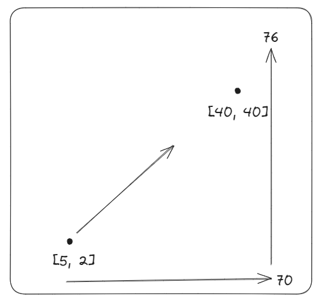

# Gradient Descent for multivariate functions   

$f(x, y) = x^2 + 4y + 8y^2$   
For multivariate functions, Derivative is called as $Gradient$ (vector of partial derivatives).  

For example, $f(x, y) = x^2 + 4y + 8y^2$   

$\nabla f\left(\begin{bmatrix}1 \\ 3\end{bmatrix}\right) = \begin{bmatrix}2x \\ 4+16y\end{bmatrix} = \begin{bmatrix}2 \\ 52\end{bmatrix}$  

## Back to field example   

$d(x, y) = (x-40)^2 + (y-40)^2$  

$\nabla d(x, y) = \begin{bmatrix}2(x-40) \\ 2(y-40)\end{bmatrix}$   

$\nabla d\left(\begin{bmatrix}5 \\ 2\end{bmatrix}\right) = \begin{bmatrix}2(5-40) \\ 2(2-40)\end{bmatrix}$  

$= \begin{bmatrix}-70 \\ -76\end{bmatrix}$  

$-\nabla d\left(\begin{bmatrix}5 \\ 2\end{bmatrix}\right) = \begin{bmatrix}70 \\ 76\end{bmatrix}$     