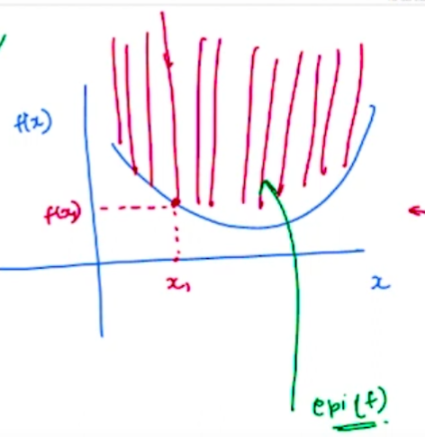
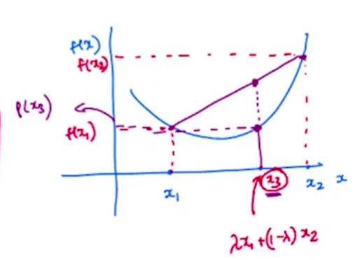
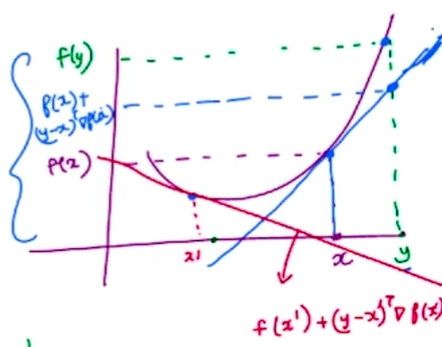

# Convex Functons

**1. Introduction to Convex Functions:**
   - Convexity is a crucial concept in machine learning, especially when assessing the goodness of outputs, often measured using performance functions.
   - Functions encountered in machine learning are often of convex nature.

**2. Definition of Convex Functions:**
   - A function $f: \mathbb{R}^d \rightarrow \mathbb{R}$ is convex if its epigraph is a convex set.
   - **Epigraph:** $epi(f) = \left\{ \begin{bmatrix} x \\ z \end{bmatrix} \in \mathbb{R}^{d+1} : z \geq f(x) \right\}$.
   - Pictorially, this means that the region above the graph of the function is convex.
   - Another definition involves comparing convex combinations of function values for two points and ensuring the result remains below the linear interpolation.  
   
   

**3. Alternate Definitions of Convexity:**
   - **Alternate Definition 1:**  
   A function $f$ is convex if for all $x_1, x_2 \in \mathbb{R}^d$ and $\lambda \in [0, 1]$, $f(\lambda x_1 + (1 - \lambda)x_2) \leq \lambda f(x_1) + (1 - \lambda)f(x_2)$.  
   
   
   
   - **Alternate Definition 3:**  
   If $f$ is differentiable, it is convex if and only if $f(y) \geq f(x) + (y - x)^\top \nabla f(x)$ (Linear Approximation Hyperplane for a function at point $x$) for all $x, y \in \mathbb{R}^d$.   
   A function $f$ is said to be convex if and only if it's graph is always above it's tangent hyperplane.
   
   
   
   - **Alternate Definition 4 (with Second Derivatives):** If $f$ is twice differentiable, it is convex if and only if its Hessian matrix is positive semi-definite.

**4. Intuition Behind Definitions:**
   - Definitions are tools to establish convexity based on different perspectives: epigraph, convex combinations, linear approximations, and positive semi-definite curvature.

**5. Practical Application:**
   - The choice of definition depends on the context and the function being analyzed.
   - These definitions provide a comprehensive toolkit for proving convexity, crucial in machine learning optimization problems.

**6. Example: Convexity of $x^2$:**
   - Demonstrated how the four definitions apply to prove that $f(x) = x^2$ is convex using the positive semi-definite property of the second derivative.

Understanding these definitions equips us with multiple ways to approach proving the convexity of functions, essential in various machine learning applications.

# Function of two variable:
$\text{Hessian Matrix} = \begin{bmatrix}f_{xx} & f_{xy} \\ f_{yx} & f_{yy}\end{bmatrix}$  

The determinant of the Hessian matrix should be non negative and $f_{xx} > 0$ for the function to be convex.